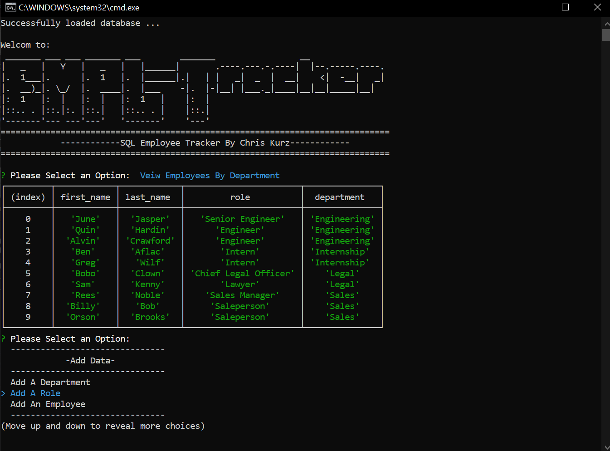

# EMPL-Tracker

## Description
This is a command line app that uses a local SQL database to manage, store and update company employees, roles and departmnets. 

## Screenshots

## Table of Contents  
    
* [Installation](#installation)
* [Usage](#usage) 

## Installation
The app requires Node.js to be installed on the system.
Once Node.js si installed:
run: npm i (only needed initially)
run: node EMPLT 
         

## Usage
Select an option from the main menu and follow the prompts to input or update data.
           
## Questions
Chris Kurz              [Github](https://github.com/chriskurz098)

If you have any questions, contact Chris Kurz at:

[ckurz098@gmail.com](mailto:ckurz098@gmail.com)

